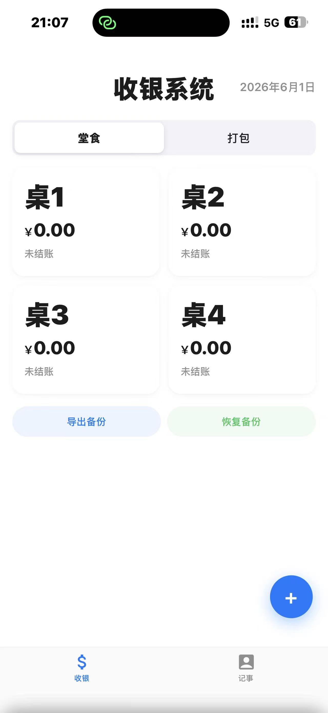
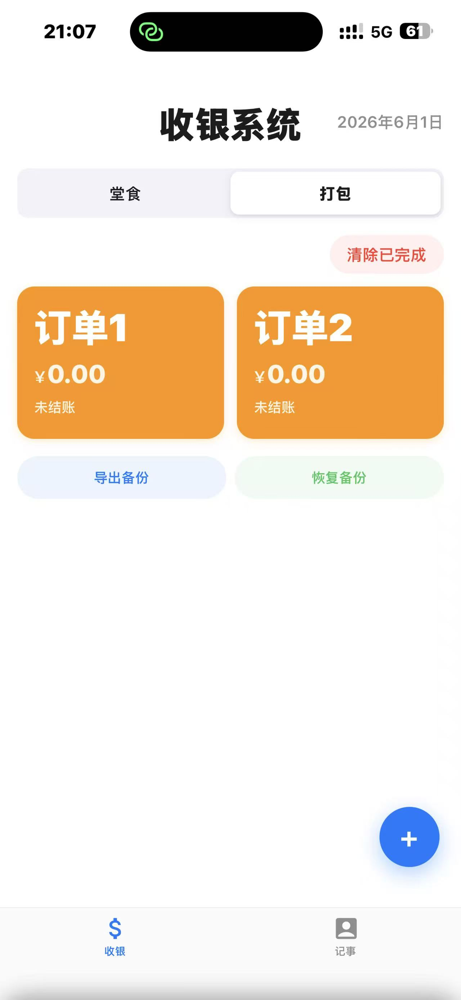

# BBQ Cashier (烧烤收银管理系统)

移动端烧烤店收银管理工具，纯前端单文件应用，无后端依赖。

## 功能

- **堂食 & 打包** — iOS 风格分段控制器切换，分别管理桌台和外卖订单
- **金额记录** — 每桌/每单记录消费金额，支持备注
- **结账追踪** — 未结账 / 已结账状态标记，颜色区分一目了然
- **记事本** — 内置备忘录，支持左滑删除
- **数据安全** — 三重存储（内存 → localStorage → IndexedDB），每日自动备份
- **导出恢复** — JSON 格式导出备份，可随时恢复数据
- **PWA 支持** — 可添加到手机主屏幕，接近原生 App 体验

## 技术栈

- 纯 HTML/CSS/JavaScript，单文件零依赖
- iOS 18 色彩系统 + SF Pro 字体
- IndexedDB 浏览器本地数据库
- Safe Area 适配（刘海屏 / 灵动岛）

## 截图

### 收银台

### 订单管理

### 打印小票

## 使用方式

直接在浏览器中打开 `index.html` 即可使用。建议部署到静态托管服务（如 GitHub Pages）后在手机上通过 Safari/Chrome 访问，体验最佳。
